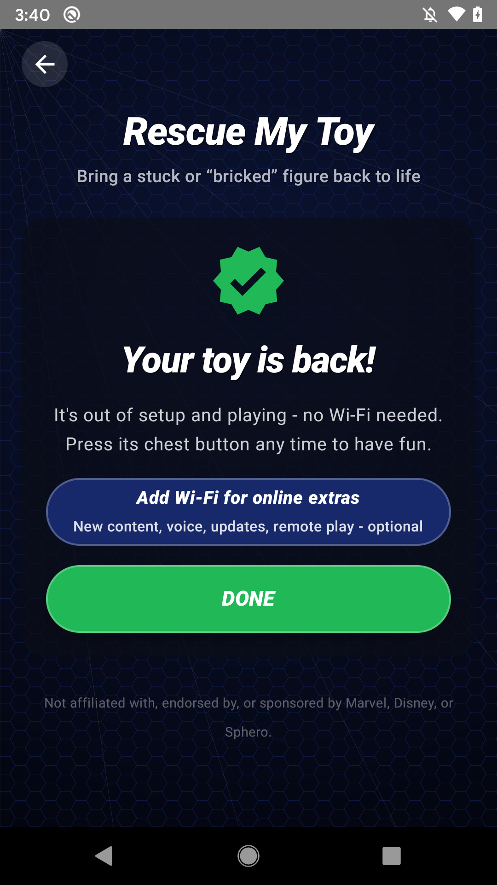
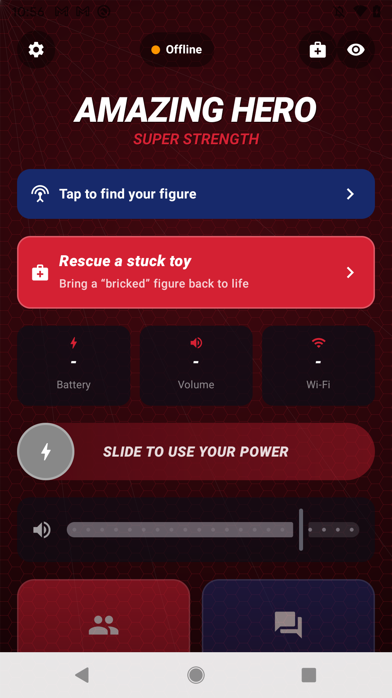

# Second Life Toys

**Bring your abandoned interactive toy back to life.**

Second Life Toys is a free, community-run project that revives the Sphero Spider-Man interactive toy (the talking 2017 figure) after the manufacturer discontinued its official app and shut down the servers that the toy relied on. Thousands of these toys went dark, got stuck mid-setup, or shipped brand new and could never be set up at all. Second Life Toys stands in for the servers that are gone and gives you free apps that talk to the toy directly.

If you have one of these toys sitting in a drawer because "the app doesn't work anymore," this project is for you.

---

## The problem

When the official app and cloud service were retired, the toys did not stop being good hardware. They stopped being able to *finish what they were doing*. Point one at the old app and nothing happens. Some are stuck partway through setup. Some were factory-reset and can never come back on their own. Some say "download the app" forever. The toy is fine. The service it was leaning on is just gone.

## What Second Life Toys does

- **Free companion apps for iOS and Android** that connect to the toy over Bluetooth LE.
- **A replacement cloud service** that stands in for the discontinued official servers, for the one step that still needs the internet (loading content onto a completely blank toy).

Once the toy has its content on board, everything works over Bluetooth with no Wi-Fi and no account. The apps can:

- **Rescue** stuck, half-set-up, "bricked," or factory-reset toys and walk them back to a playable state.
- **Reconnect Wi-Fi** and finish setup.
- **Re-download content** onto a blank toy.
- **Control the toy**: play activities, guard mode, eye colors and expressions, alarms, and the play dashboard.

## Which one are you?

Almost everyone is in one of two situations. Pick yours; it decides your first step.

- **A) I used it before.** The toy still plays: press its chest and it tells jokes or starts a game. The catch is that on a normal power-on it does **not** broadcast Bluetooth, so the app cannot find it. The fix is a full power-cycle reboot to open a fresh Bluetooth window. See [Getting started, path A](docs/getting-started.md#path-a-i-used-it-before) and the [reboot steps](docs/troubleshooting.md#full-reboot-to-get-a-bluetooth-window-case-a).
- **B) I never set it up** (new in box, or factory-reset to fresh). It boots into setup mode with a blinking chest and broadcasts Bluetooth on its own, so the app finds and rescues it directly. See [Getting started, path B](docs/getting-started.md#path-b-i-never-set-it-up).

Not sure? Press the chest button. If it plays a joke or a game, you are **A**. If it just blinks and waits, you are **B**.

## Rescue your toy (quick start)

1. **Get the app.** Follow [Getting started](docs/getting-started.md) to join the iOS beta or install the Android APK.
2. **Turn on Bluetooth** on your phone, and keep the toy right next to it.
3. **Get the toy broadcasting.** If you *used it before* (path A), do a [full reboot](docs/troubleshooting.md#full-reboot-to-get-a-bluetooth-window-case-a) and let the startup music finish. If you *never set it up* (path B), it is already broadcasting.
4. **Open the app and tap Rescue, then Scan.** The app finds the toy, figures out what state it is in, and runs the fixes it can do on its own. It only asks you for a Wi-Fi password or a hero name if the toy actually needs one.
5. **Play.** Once the toy is set-up-complete, press its chest button and it comes back to life.

See it step by step: the [Getting Started guide](docs/getting-started.md#then-for-both-paths) walks through the whole rescue with a screenshot of every screen.

Stuck? The [troubleshooting guide](docs/troubleshooting.md) covers the common gotchas (most of them are "the phone's Bluetooth is off" or "the toy is not broadcasting yet").

## Documentation

- [What we support](docs/what-we-support.md) - supported toys, recovery scenarios, features today, and known limitations.
- [Recovery matrix](docs/recovery-matrix.md) - the plain-language table of "toy states we can recover" and current support.
- [Getting started](docs/getting-started.md) - join the beta, device requirements, and the two paths (used it before / never set it up).
- [Troubleshooting](docs/troubleshooting.md) - friendly tips for when a scan or connection does not work, including the full-reboot steps.
- [Report a bug](docs/report-a-bug.md) - how to file an issue and share a diagnostic log.
- [FAQ](docs/faq.md) - is it legal, is it safe, is it free, what data do you collect, and more.
- [Roadmap](docs/roadmap.md) - where the project is and what is next.

## Contributing and community

This is a community project and help is welcome. See [CONTRIBUTING.md](CONTRIBUTING.md) and our [Code of Conduct](CODE_OF_CONDUCT.md). The friendliest first contribution is simply trying the app on your toy and telling us what happened.

## Disclaimer

Second Life Toys is an independent community project. **It is not affiliated with, endorsed by, or sponsored by Marvel, Disney, or Sphero.** "Sphero" and "Spider-Man" are used only to describe which discontinued toy this project is compatible with, as a plain statement of fact. All trademarks belong to their respective owners. This project uses no Marvel, Disney, or Sphero artwork, logos, or copyrighted assets.

The full statement, along with a safety and "use at your own risk" note, is in [DISCLAIMER.md](DISCLAIMER.md).

## License

Documentation in this repository is licensed under [Creative Commons Attribution 4.0 (CC BY 4.0)](LICENSE). The apps and other software are covered by their own licenses in their own repositories.
