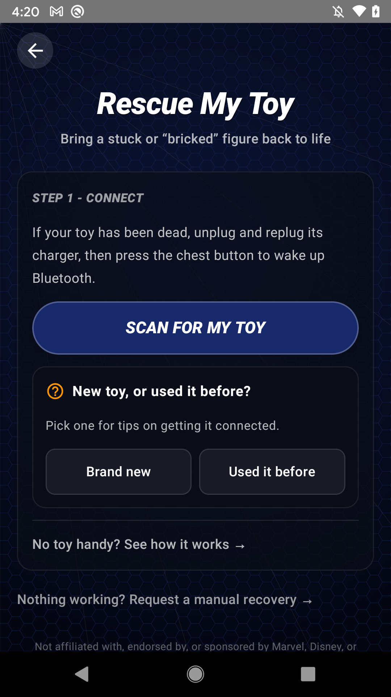
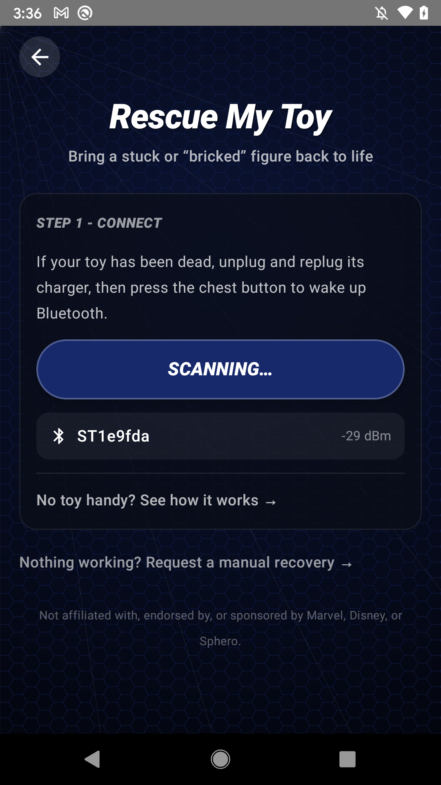
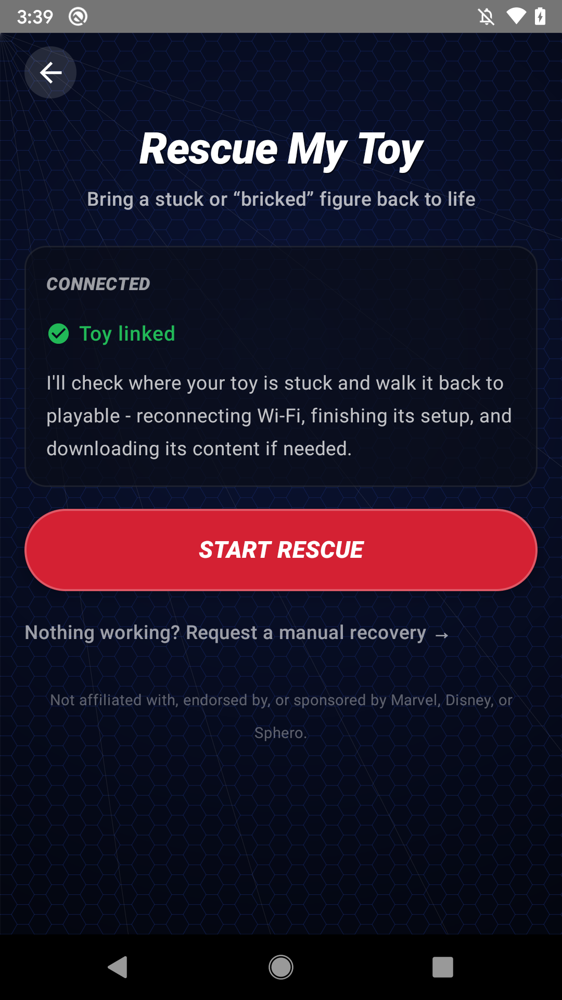
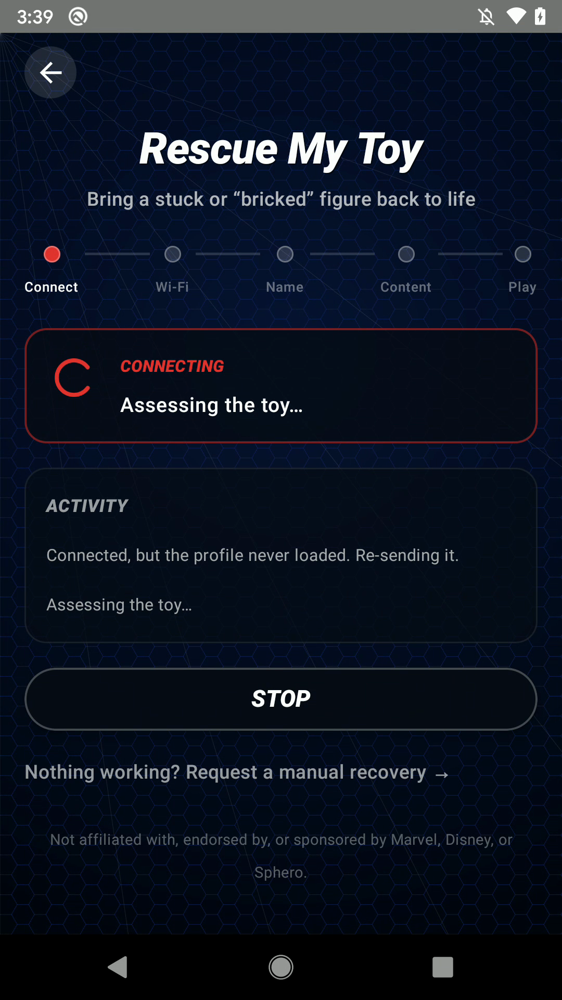

# Getting started

Second Life Toys is in **private beta**. This page walks you through joining the beta on your platform, working out which of the two paths you are on, and making your first connection to the toy.

## What you need

- The **Sphero Spider-Man interactive toy** (the 2017 talking figure), charged and powered on.
- A phone or tablet with **Bluetooth**:
  - **iPhone or iPad** running **iOS 16 or later**, or
  - An **Android phone** running **Android 8.0 or later**.
- A few minutes and, for a completely blank toy only, your **Wi-Fi network name and password**. (Most toys do not need this. See the [recovery matrix](recovery-matrix.md).)

You do **not** need an account, a sign-in, or to give us any personal information to rescue or play with your toy.

## Which one are you?

Every toy is in one of two situations, and they start differently. Press the toy's chest button to tell them apart:

- **If it plays a joke, tells a story, or starts a game, you are Path A ("I used it before").** It still has all its content, but on a normal power-on it does not broadcast Bluetooth, so the app cannot find it yet. You need to open a Bluetooth window with a full reboot.
- **If it just blinks (a blinking chest) and waits, you are Path B ("I never set it up").** It is in setup mode and broadcasts Bluetooth on its own, so the app can find it right away.

The app itself asks you the same question. On the **Rescue** screen (and under **Settings > Connect Your Toy**) there is a "New toy, or used it before?" chooser. Pick **Used it before** or **Brand new** and it shows the guidance for your path, including the reboot walkthrough for used toys.

## Join the beta

### iOS (Apple TestFlight)

The iOS app is distributed through Apple's TestFlight, and it is invite-only during the private beta.

1. **Request an invite on Reddit.** Comment on our pinned Second Life Toys beta thread in [r/Sphero](https://www.reddit.com/r/Sphero/) with the email address you want the invite sent to. Use the same email as your Apple ID / App Store, since that is the address we add to the beta.
2. **We add you to the TestFlight group** and you will get an email invitation from TestFlight.
3. **Install TestFlight** from the App Store on your iPhone or iPad if you do not already have it.
4. **Open the invitation** and tap Accept, then install Second Life Toys from within TestFlight.
5. TestFlight will notify you when there is a new beta build to update to.

TestFlight is Apple's official beta system, so this is a normal, safe install path. TestFlight builds do expire periodically; if the app stops opening after a while, check TestFlight for an update.

### Android (sideload the APK)

The Android app is currently distributed as a **signed APK** that you install directly. A Google Play testing track is planned (see the [roadmap](roadmap.md)), but for now you install the APK by hand. This is called sideloading.

1. **Download the APK** to your Android phone from: **`https://github.com/second-life-toys/second-life-toys/releases/latest/download/second-life-toys.apk`**.
2. **Allow installs from this source.** When you open the APK, Android will ask whether to allow installing apps from that source (your browser or Files app). Approve it. On modern Android this is a per-app permission (Settings can also be reached under Apps > Special access > Install unknown apps).
3. **Tap the downloaded APK** and choose Install.
4. **Open Second Life Toys.**

Notes on safety: only install the APK from the official link above. The APK is signed, so once you have installed our build, updates signed with the same key will install cleanly over it. If an APK ever refuses to install over an existing one, that is Android telling you the signatures do not match, which is a signal to double-check where you got it.

## First connection

The order that matters most: **get the toy broadcasting, connect, then use the controls.** The play controls (activities, guard mode, alarm, eyes) only work once the app is connected over Bluetooth. Before you connect, only **Rescue** and **Connect** are active.

Common setup for both paths:

1. **Turn on your phone's Bluetooth.** This sounds obvious, but a disabled Bluetooth adapter is the single most common reason a scan finds nothing. Make sure it is fully on.
2. **Put the toy right next to the phone.** Bluetooth LE range is short; keep them close.

### Path A: I used it before

Your toy has its content and plays on a chest press, but it will not appear in a scan until you give it a fresh Bluetooth window with a full reboot.

1. In the app, open **Rescue** (or **Settings > Connect Your Toy**) and choose **Used it before**. It shows the same reboot steps below.
2. **Full-reboot the toy** (verbatim):
   1. Press and hold the chest button about 5 seconds, until you hear a "duh-dun-duh-dun-dun" sound.
   2. The chest light flashes off, back on, then off again. That is it powering down.
   3. Wait about 10 seconds.
   4. Press and hold the chest button again until the light glows, then let go.
   5. It boots up and plays its startup music. Let the music finish.
   6. Now it is broadcasting Bluetooth. Open the app and tap Scan.
3. **Connect** to the toy when it appears.

There is a picture-by-picture version of these steps in [Troubleshooting](troubleshooting.md#full-reboot-to-get-a-bluetooth-window-case-a).

### Path B: I never set it up

Your toy is in setup mode (blinking chest) and is already broadcasting Bluetooth.

1. In the app, open **Rescue** and choose **Brand new**.
2. **Tap Scan.** The app looks for a toy advertising with a name starting with `ST`.
3. **Connect** to your toy when it appears.

### Then, for both paths

Here is the whole rescue, one screen at a time.

**1. Open Rescue.** From the dashboard, tap **Rescue a stuck toy**.

**2. Scan for your toy.** Tap **Scan for my toy**. The "New toy, or used it before?" helper is right here if you need it.

**3. The toy appears.** It shows up as a name starting with `ST`. Tap it to connect.

**4. Toy linked.** The app connects and shows **START RESCUE**.

**5. Start the rescue.** The app diagnoses the toy's state and runs the fixes it can do on its own. It only stops to ask you for a Wi-Fi password or a hero name if the toy actually needs one.

**6. You are back.** When the rescue finishes, the app tells you, and a chest press brings the toy to life.

If the app does not find the toy, do not worry, that is usually one of a handful of simple things. Head to [Troubleshooting](troubleshooting.md); the top tips are to re-broadcast the toy (a full reboot for a used toy) and to confirm the phone's Bluetooth is truly on.

Want to see how it works before your toy is handy? Both apps include a **demo / preview mode** that walks through the rescue-and-play experience with a simulated toy.
