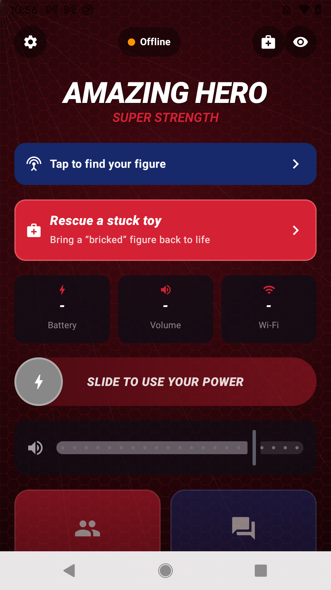
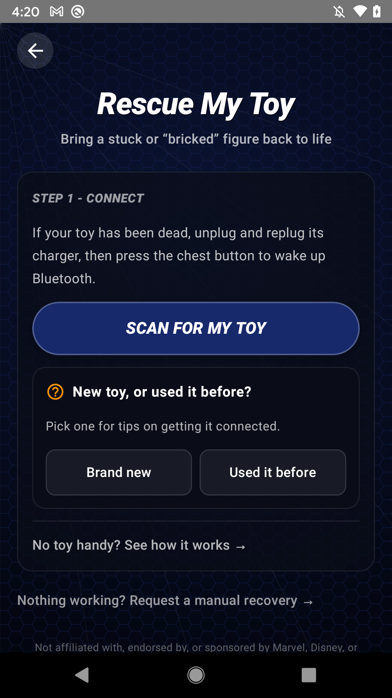
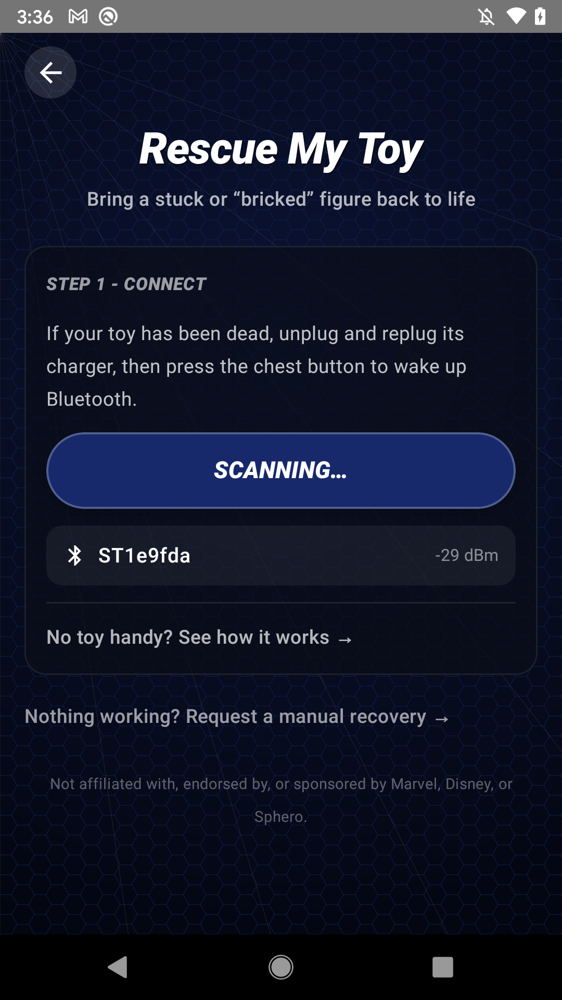
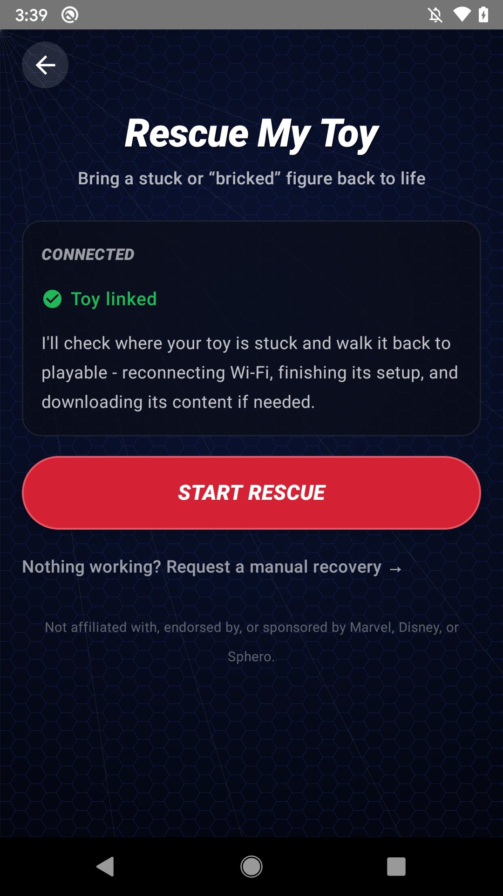
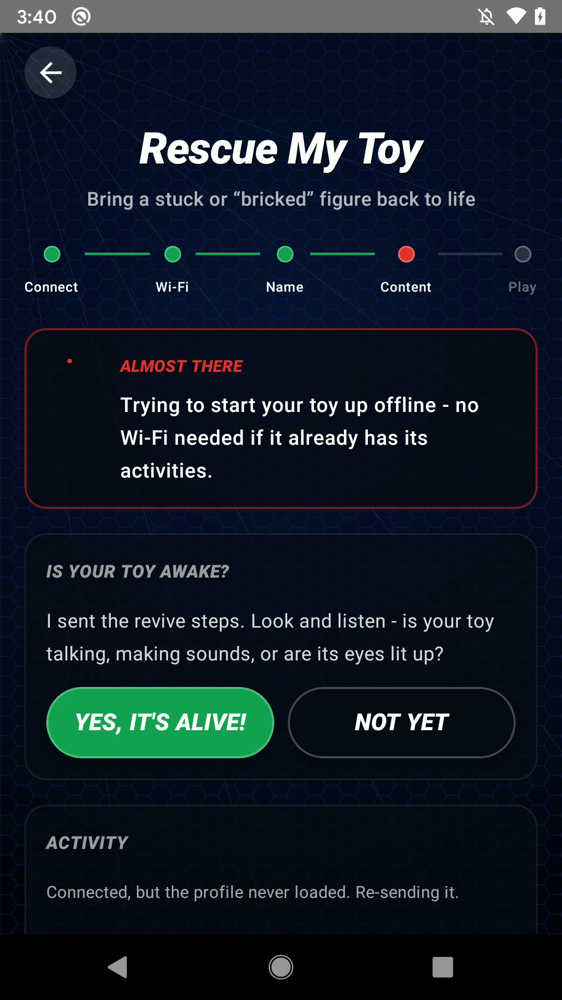
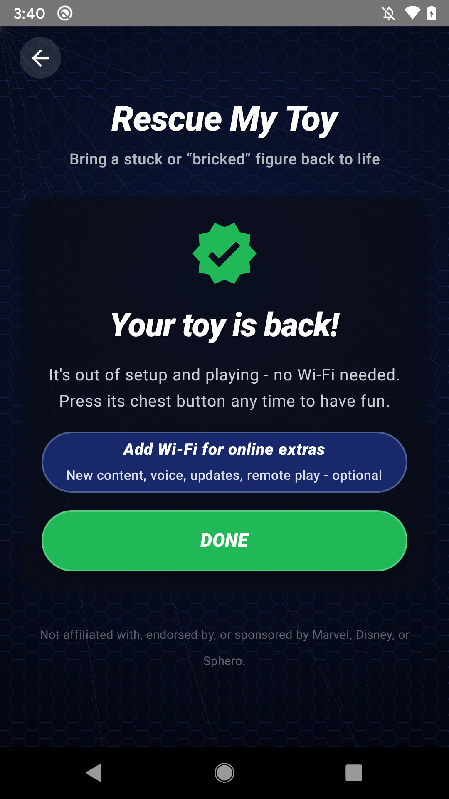
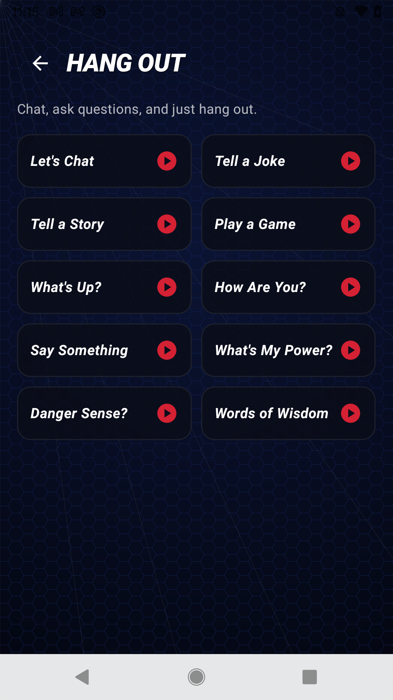

# Getting started

Welcome. This page gets the free app onto your phone and connects it to your Spider-Man toy. It takes about five minutes, and most of that is just waiting for the toy's startup music. We walk you through every tap.

*Not affiliated with, endorsed by, or sponsored by Marvel, Disney, or Sphero. This is a fan-made project to bring a discontinued toy back to life.*

## What you need

- The **Sphero Spider-Man interactive toy** (the 2017 talking figure), charged and turned on.
- A phone or tablet with **Bluetooth** (that is the short-range wireless your phone uses for headphones and such):
  - **iPhone or iPad** on **iOS 16 or later**, or
  - An **Android phone** on **Android 8.0 or later**.
- For a completely blank toy only, your home **Wi-Fi name and password**. Most toys never need this. (See the [recovery matrix](recovery-matrix.md) for which ones do.)

You do **not** need an account, a sign-in, or to give us any personal information. There is no sign-in at all.

## Which kind of toy do you have?

There are two kinds, and they behave a little differently. To tell which one you have, **press the toy's chest button** and watch:

- **If it plays a joke, tells a story, or starts a game, you used it before.** It still has everything on board. The catch: when you just turn it on, it does not call out over Bluetooth, so your phone cannot spot it yet. You will fix that with a quick full reboot (steps below).
- **If it only blinks and waits, it was never set up.** It is already calling out over Bluetooth, so your phone can find it right away.

One word you will see a lot: **broadcasting.** For your phone to find the toy, the toy has to be *broadcasting* over Bluetooth, which just means calling out, like waving so the phone can spot it in a crowd. The toy only does this for about 30 seconds after you turn it on or press its chest, then it goes quiet again. If a scan finds nothing, that quiet window is usually why, and you just wake it up again.

## Get the app

### iPhone or iPad (TestFlight)

The iPhone version is invited by hand through Apple's official beta app, TestFlight. A real person adds you, so it can take a little while.

1. **Ask for an invite on Reddit.** Send a private message (a "DM") to the maintainer on [r/Sphero](https://www.reddit.com/r/Sphero/). Sending a message needs a free Reddit account. In the message, include the email on your **Apple ID** (your App Store email), because that is where the invite is sent. If this iPad or iPhone is signed in with a parent's Apple ID, use the parent's email and have them accept the invite.
2. **Wait for the email invitation** from TestFlight.
3. **Install TestFlight** from the App Store, if you do not have it already.
4. **Open the invitation, tap Accept,** then install Second Life Toys from inside TestFlight.
5. TestFlight tells you when a newer version is ready. If the app ever stops opening after a few months, that just means the beta expired, so check TestFlight for an update.

TestFlight is Apple's own beta system, so this is a normal, safe way to install.

### Android (install the app)

Second Life Toys for Android is very early and still being built, so it is not in the Google Play Store yet. You install it from our official page as an **APK** (that is just the file that installs an Android app, like a `.exe` on a computer). This is safe when you get the file from the link below.

1. **Open the Releases page** on your Android phone: [github.com/second-life-toys/second-life-toys/releases](https://github.com/second-life-toys/second-life-toys/releases). Under the newest release, tap the file whose name ends in **`.apk`** to download it.
2. **When it finishes, tap the download.** Look for a "download complete" note in your notifications and tap it. If you miss it, open the **Files** app, go to **Downloads,** and tap the `.apk` file there.
3. **Say yes to "install unknown apps."** Android may ask whether to allow installing apps from your browser or Files app. Tap to allow it. *This sounds scarier than it is.* It only means the app did not come from the Play Store, and you are turning it on for your browser this one time.
4. **If Android warns it does not recognize the app's maker, that is expected** for any app not yet in the Play Store. Tap **More details,** then **Install anyway.**
5. **Tap Install.** You will see a grey install screen, then "App installed" with an **Open** button.
6. **Tap Open** to start Second Life Toys.

Only ever install this app from the official Releases page above. Later updates from that same page will install right over the top. If an update ever refuses to install, that is Android saying the new file did not come from the same place as the app you already have, so delete the old app and reinstall from the official link.

## Revive your toy

This is the main event, one screen at a time. Follow it top to bottom.

**1. Turn your phone's Bluetooth ON.** You should see the Bluetooth icon in your status bar. A phone with Bluetooth off is the number-one reason a scan finds nothing, and it fails silently with no error, so double-check this one.

**2. Keep the toy right next to the phone.** Bluetooth only reaches a short distance, so set the toy down beside the phone, not across the room.

**3. Used your toy before? Reboot it first.** (Skip this if your toy only blinks and waits, it is already broadcasting.) A used toy will not show up until you give it a fresh broadcasting window with a full reboot:

  1. Press and hold the chest button about 5 seconds, until you hear a "duh-dun-duh-dun-dun" sound.
  2. The chest light flashes off, back on, then off again. That is it powering down.
  3. Wait about 10 seconds.
  4. Press and hold the chest button again until the light glows, then let go.
  5. It boots up and plays its startup music. Let the music finish.
  6. Now it is broadcasting. Move to the next step right away, the window is short.

**4. Open the app and tap "Rescue a stuck toy."** The app opens to a dashboard. Tap the red **Rescue a stuck toy** button.

**5. Tap "Scan for my toy."** The button changes to "Scanning..." while it looks for your toy.

**6. Your toy appears. Tap it.** It shows up as a name that starts with **`ST`** (for example `ST1e9fda`). Tap that name to connect.

**7. It says "Toy linked." Tap START RESCUE.** A green check and "Toy linked" mean you are connected. Tap the red **START RESCUE** button.

**8. Let the app do its thing.** It figures out what is wrong and fixes what it can on its own. It only stops to ask you for something if the toy truly needs it. **Only a completely blank toy needs Wi-Fi,** and only once, to download its content. If it does ask, type your home Wi-Fi name and password (or a hero name), which is normal and one-time. Most toys revive over Bluetooth with no Wi-Fi at all.

**9. "Your toy is back!"** When the app says you are done, press the toy's chest button. It plays a joke or starts a game, just like before.

If the toy never showed up in step 6, do not worry, it is almost always one small thing. See [Troubleshooting](troubleshooting.md). The top two tips: make sure your phone's Bluetooth is truly on, and reboot a used toy to reopen its broadcasting window.

## Just want to play?

If your toy already works and you just want to control it, use the play path instead of Rescue.

1. On the dashboard, tap **Tap to find your figure.**
2. Tap **Scan for my toy,** then tap your toy (the name starting with `ST`) when it appears.
3. **The first time only,** you will see a **Wake Your Figure** screen. Press the toy's chest button, then tap **Done.**
4. Now you are on the dashboard, connected. You can start activities (Team Up, Hang Out, Fight Villains), turn on Guard Mode, set an alarm, change the eye colors, and adjust the volume. When you tap an activity, the toy plays it.

## No toy handy?

Want to see how the app works before you dig the toy out? On the Rescue screen, tap **No toy handy? See how it works.** It runs a quick preview with no toy needed, so you can look around safely.

## If it does not work

Head to [Troubleshooting](troubleshooting.md). Nearly every "it will not find my toy" moment is one of a few simple things, and the two that fix it most often are: confirm your phone's Bluetooth is genuinely on, and reboot a used toy to reopen its short broadcasting window.
