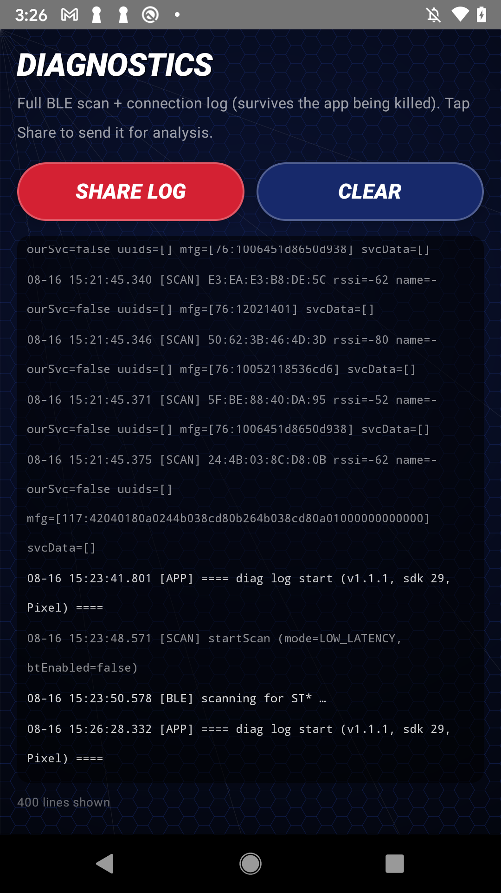

# Report a bug

Bug reports are genuinely how this project gets better, especially reports that include a **diagnostic log**. The log captures what the app saw during the Bluetooth scan and connection, which is usually enough for us to spot what went wrong without needing your toy in hand.

## Before you file

Have a quick look at [Troubleshooting](troubleshooting.md) first. A lot of "it did not work" moments are a phone Bluetooth toggle or the toy's short broadcast window, and those are faster to fix than to file. If it still is not working, please do tell us.

## Grab a diagnostic log

The app keeps an on-device log of what happens during scans and connections, and it can export that log as a plain text file you attach to your report.

**On Android:**

1. Open the app and go to **Settings**.
2. Tap **Diagnostics**.
3. Tap **Share Log**.
4. Choose how to send it (email it to yourself, save it to Files, or share it straight into your bug report). The exported file is named `second-life-toys-diag.txt`.

**On iOS:** the diagnostics screen mirrors the Android one. Go to **Settings > Diagnostics > Share Log** and use the share sheet to save or send the file.

Tip: reproduce the problem first (try the scan or the rescue that failed), then export the log right after, so the failure is fresh at the end of the log.

## What the log contains (and what it does not)

The diagnostic log is there to debug Bluetooth and connection problems, so it contains technical, non-personal information:

- Bluetooth scan results (which devices were seen advertising, and their advertising data).
- Scan start and failure events.
- The connection attempt and its Bluetooth state.
- The raw packets sent to and received from the toy during the session.
- Basic app and phone info (app version, Android/iOS version, phone model) to help us reproduce it.

It does **not** contain your account details, your contacts, your location, your Wi-Fi password, or any personal content. It is a technical trace of the app talking to the toy. You are welcome to open the `.txt` file and read it before you send it; it is plain text.

## Open the issue

1. Go to the project's GitHub issues page: **`<GITHUB_REPO_URL>`/issues** (maintainer: fill in the repo URL).
2. Click **New issue** and pick **Bug report**.
3. Fill in the template. It asks for the important things: what state the toy was in, your phone model and OS version, the app version, the steps you took, and what happened.
4. **Attach your diagnostic log** (`second-life-toys-diag.txt`) to the issue. On GitHub you can drag the file into the comment box, or use the attachment control.
5. Submit.

If you cannot use GitHub, you can email the same details and the log file to **`<BETA_REQUEST_EMAIL>`** (maintainer: fill this in).

## Privacy reassurance

We only want what helps us fix the problem. The diagnostic log is technical, not personal. If you would rather trim anything out of it before sending, go ahead; it is a plain text file. And if you ever spot something in a log you are not comfortable sharing, tell us and we will work with whatever you can give.

Thank you for taking the time. Every report, even a "this happened and I do not know why," moves the project forward.
