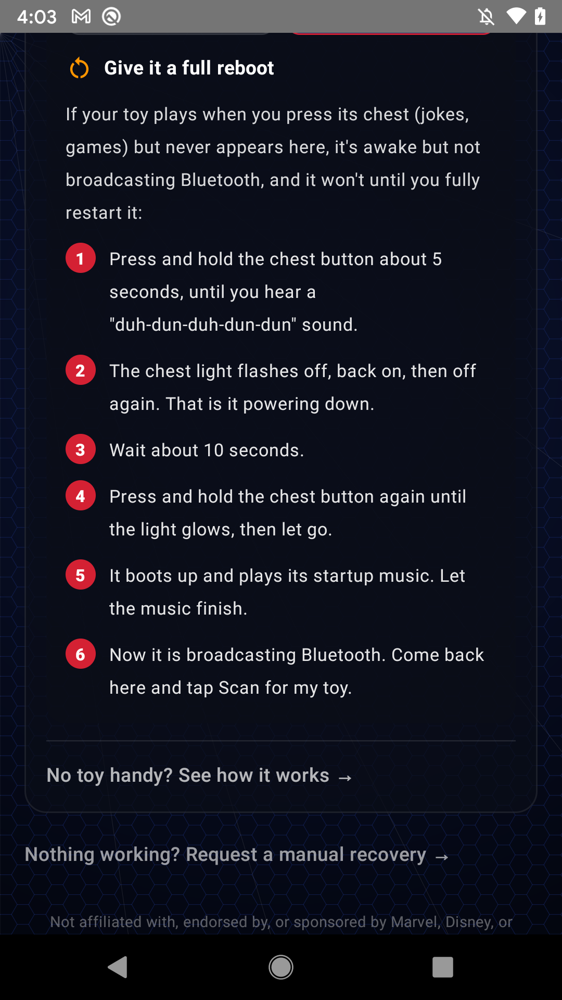

# Troubleshooting

Most "it is not working" moments come down to a few small things, and almost all of them are on the phone side or the toy not broadcasting Bluetooth yet. Here are the friendly tips, roughly in the order worth trying.

First, a quick orientation: which situation are you in?

- **You used the toy before** and it plays on a chest press (jokes, games) but the app cannot find it. This is the number-one case, and it is almost always because the toy is not broadcasting Bluetooth on a normal boot. The fix is a [full reboot](#full-reboot-to-get-a-bluetooth-window-case-a).
- **You never set it up** (new in box or factory-reset to fresh) and it blinks and waits. It broadcasts on its own, so if the app still cannot see it, work through [The toy does not show up when I scan](#the-toy-does-not-show-up-when-i-scan).

## Full reboot to get a Bluetooth window (Case A)

If the toy plays when you press its chest but never appears in the app, it has its content and is running fine; it just is not advertising Bluetooth on a normal boot. A full power-cycle opens a fresh broadcast window. The app shows this same walkthrough when you choose "Used it before" on the Rescue screen.

1. Press and hold the chest button about 5 seconds, until you hear a "duh-dun-duh-dun-dun" sound.
2. The chest light flashes off, back on, then off again. That is it powering down.
3. Wait about 10 seconds.
4. Press and hold the chest button again until the light glows, then let go.
5. It boots up and plays its startup music. Let the music finish.
6. Now it is broadcasting Bluetooth. Open the app and tap Scan.

If the first try does not catch it, the broadcast window is short, so just repeat the reboot and tap Scan promptly once the startup music ends.

## The toy does not show up when I scan

This is the big one, and it is almost always fixable in under a minute.

- **If you used the toy before, do the [full reboot](#full-reboot-to-get-a-bluetooth-window-case-a) first.** A used toy that plays on a chest press is not broadcasting until you power-cycle it. This is the most common miss.
- **Confirm your phone's Bluetooth is fully ON.** A disabled Bluetooth adapter makes a scan quietly return nothing, with no error at all, which looks exactly like "the toy is not there." Check Bluetooth in your phone's settings and turn it on. If it was already on, toggle it off and back on to clear any stuck state.
- **Scan right after the toy starts broadcasting.** A fresh boot (or, on a setup-mode toy, a chest press) opens a short broadcast window, only about **30 seconds**. Get the toy broadcasting, then immediately open the app and scan. If you wait too long, the window closes and you see nothing.
- **Keep the toy right next to the phone.** Bluetooth LE range is short. Set the toy down next to the phone rather than across the room.
- **Keep the app in the foreground with the screen on.** Do not switch away to another app or let the screen sleep while scanning. Backgrounded scans and a sleeping screen can silently drop results.
- **Do not hammer the Scan button.** Tapping Scan over and over in quick succession can make the system throttle scanning and return nothing. Tap it once and give it a few seconds.

## The controls (Hang Out, Guard Mode, Alarm) are greyed out or do nothing

The play controls only work while the app is **connected to the toy over Bluetooth**. Before you connect, only **Rescue** and **Connect** are active. Connect first (see [Getting started](getting-started.md#first-connection)), and once the app shows the toy is linked, the activity cards, guard mode, alarm, and eye controls come alive. When you tap an activity, the app briefly shows "Sending..." and then "Sent to your figure" at the bottom, so you can tell it went through.

## It found the toy but will not connect, or drops the connection

- **Move closer** and remove obvious sources of interference (a crowded 2.4 GHz area, the toy behind metal, and so on).
- **Reboot the toy** and try again from a fresh broadcast window.
- **Only one thing can hold the Bluetooth connection at a time.** If you have another phone, tablet, or a previous session still connected to the toy, disconnect it first. If in doubt, reboot the toy to drop any stale connection.
- **Restart the app** if a connection seems wedged.

## Rescue asks for Wi-Fi, but I do not have the password / do not want to

Most toys do **not** need Wi-Fi to be revived; their content is already on board. If the app is asking, it is because this particular toy looks like it needs a one-time content download. You can:

- Enter your home Wi-Fi network name and password to let it download, or
- If you are not ready, come back to it later. The rescue for a truly blank toy is the case that needs the network step. See the [recovery matrix](recovery-matrix.md) for which states need Wi-Fi.

## The toy connects and setup finishes, but a button press still says "grab the app"

This usually means the toy never recorded that it finished setup (often because it was offline at the time). Run **Rescue** again, all the way through. The app can mark setup as complete so the toy stops sending you back to the app. This is state 5 in the [recovery matrix](recovery-matrix.md).

## Wi-Fi will not stick / the toy keeps going back to an old network

Toys can hold on to a previously saved network. Running Rescue again and letting the app manage the Wi-Fi step is the clean way through. If it keeps fighting you, note it in a [bug report](report-a-bug.md) with a diagnostic log so we can see what the toy is reporting.

## The eyes never light and nothing appears in a scan, ever

If the toy powers on but the eyes stay dark, it never advertises over Bluetooth, and the reset button does nothing, this is the one case we cannot currently recover in software (state 6 in the [recovery matrix](recovery-matrix.md)). It looks like a hardware-level fault. Please still [tell us](report-a-bug.md); the more of these we see, the better we understand them.

## Still stuck?

Grab a diagnostic log and open a bug report. The log captures exactly what the app saw during the scan and connection, which is usually enough for us to spot the problem. Step-by-step instructions are in [Report a bug](report-a-bug.md).
