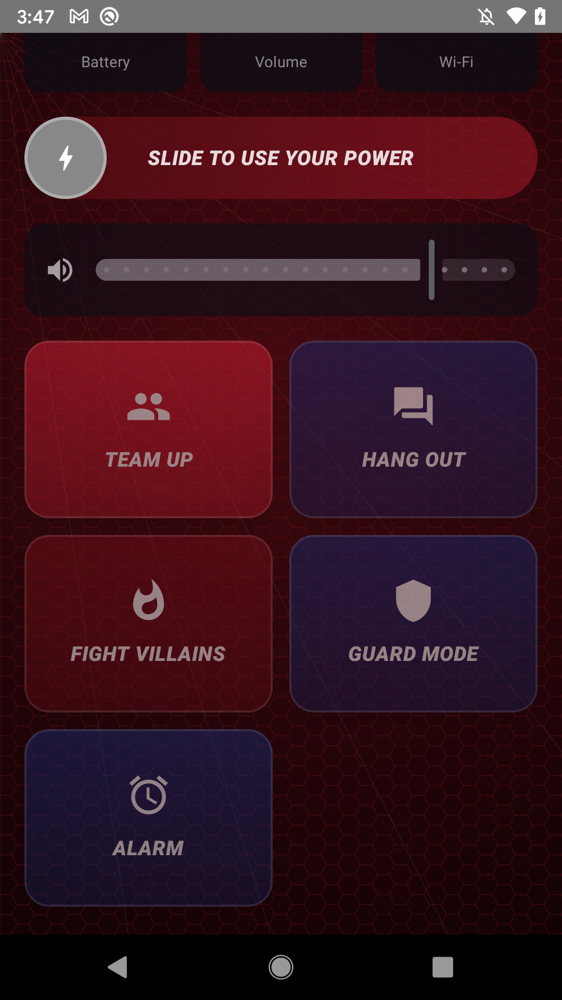
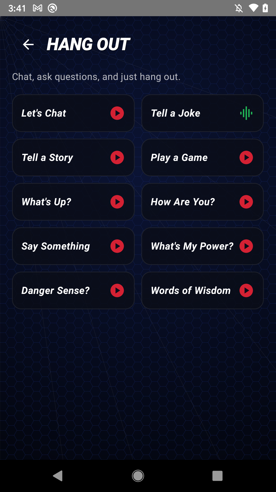

# What we support

This page is the honest, detailed version of what Second Life Toys can do today. We would rather under-promise here than surprise you later.

## Supported toy

Second Life Toys works with the **Sphero Spider-Man interactive toy**: the roughly foot-tall talking Spider-Man figure released in 2017, with light-up eyes, motion sensing, and voice interaction, that was set up through the manufacturer's (now discontinued) mobile app.

It advertises over Bluetooth with a name that starts with `ST` when it is in its setup/pairing mode. If you have this toy, you are in the right place.

We do not support other Sphero robots (for example the ball-shaped droids). Those are different hardware with different apps and are outside the scope of this project.

## Recovery scenarios

The apps are built around a "Rescue" flow: point the app at a toy, and it works out what state the toy is in and walks it back to playable. The states we handle and their current support level are laid out in the [recovery matrix](recovery-matrix.md). In short:

- **A toy that was never set up** (including new-in-box) - our primary case. Revivable, in most cases entirely over Bluetooth with no Wi-Fi.
- **A toy that was working, then got shelved and is now stuck.** Proven on hardware.
- **A toy that got stuck partway through setup** and never reaches play.
- **A toy that says "download the app" but never comes online.**
- **A factory-reset toy** (support depends on exactly what the reset wiped, see the matrix).

## Features available today

These are the features the apps ship with. The iOS app is our feature reference, and the Android app mirrors it.

A quick but important note: **the play controls only work once the app is connected to the toy over Bluetooth.** Before you connect, only **Rescue** and **Connect** are active. Connect first, then use everything else.

- **Rescue** - the headline feature. Diagnoses a stuck toy and runs the fixes automatically, asking for input (Wi-Fi password, hero name) only when the toy genuinely needs it. The connect step opens with a "New toy, or used it before?" chooser (also on **Settings > Connect Your Toy**) that gives tailored guidance, including the full-reboot walkthrough for a toy you used before.
- **Dashboard** - the play hub: hero name and power, connection status, live battery / volume / Wi-Fi readouts, a slide-to-use-power action, volume control, and quick access to activities, guard mode, and the alarm.
- **Activities** - the phrase and activity cards across the toy's interaction categories (Team Up, Hang Out, Fight Villains style groupings). Tapping a phrase shows a brief "Sending..." then "Sent to your figure" so you know it went through.

Open a category and you get its phrases, for example the Hang Out grid (Tell a Joke, Tell a Story, and more):

- **Guard mode** - arm the toy to watch the room; it logs motion it detects into a "While You Were Away" intrusion list you can read back later.
- **Eyes** - set the eye color (red, blue, white, off) and keep it lit so the toy's idle animation does not paint over it.
- **Alarm** - set a wake time with repeat days.
- **Wi-Fi setup** - scan for networks and join one, to bring a blank toy online for its one-time content download.
- **Settings** - manage your linked toys, set the hero name and power, adjust preferences, and view device info.
- **Diagnostics** - an on-device log of Bluetooth scans, connections, and packets, with a "Share Log" button for bug reports. See [Report a bug](report-a-bug.md).
- **Demo / preview mode** - a simulated toy so you can see how the rescue-and-play experience works without having a physical toy connected.

Content and account notes:

- **No account needed to rescue or play.** Connecting to and reviving your toy needs no sign-in and no personal information.
- **Optional sign-in** exists only to unlock advanced/developer features, and only after you have verified you own the toy by connecting to it locally over Bluetooth first.
- **Content is mostly offline.** A never-set-up toy already carries its content internally, so it can be revived to full play over Bluetooth alone. Wi-Fi and our replacement cloud are only needed to load content onto a completely blank toy, or to fetch content updates.

## Not yet supported / known limitations

Being transparent here is the whole point of this page.

- **A truly dead toy (dark eyes, no response).** If the toy powers on (you may hear a boot chime) but the eyes never light up, it never advertises over Bluetooth, and the reset button does nothing, we currently cannot revive it. This looks like a hardware-level fault, and no non-invasive software path has recovered one so far. See state 6 in the [recovery matrix](recovery-matrix.md).
- **Factory-reset toys are not guaranteed.** A factory reset can, in some cases, remove parts of the toy's own software, which makes recovery harder than a never-set-up toy. The Wi-Fi-based re-provisioning path is proven; the fully-offline path after a reset is still being validated. See state 3 in the matrix.
- **Some setup-stuck toys** may still need a manual, hands-on recovery rather than the fully automatic flow. The apps let you request a manual recovery for stubborn cases.
- **This is beta software.** Expect rough edges. Some flows are proven end to end on real hardware; others are built and partially validated. The [recovery matrix](recovery-matrix.md) marks the status of each honestly, and the [roadmap](roadmap.md) tracks what is next.

If your toy is in a state that is not covered here, please [tell us](report-a-bug.md). Real-world reports are how the support list grows.
